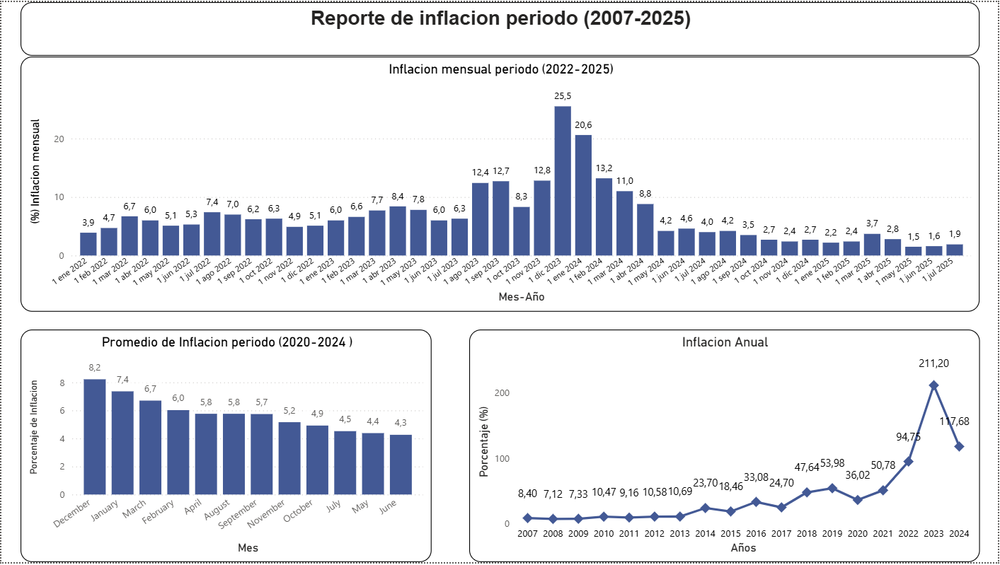

# Análisis del Comportamiento de la Inflación en Argentina 2007–2025

##  Flujo de trabajo
- Extracción → Limpieza → Análisis → Visualización → Informe

##  Objetivo
Analizar la evolución de la inflación mensual y anual en Argentina desde enero de 2007 hasta diciembre de 2025, identificando los niveles anuales registrados, los promedios mensuales estacionales (2020-2024) y la variación mensual reciente (2022-2025), con especial foco en picos, mínimos y patrones estacionales.

##  Fuentes de datos
- Datos oficiales del Banco Central de la República Argentina (BCRA): https://www.bcra.gob.ar/
- Series: Inflación mensual y anual (IPC) desde enero 2007 hasta julio 2025

##  Herramientas utilizadas
- Python: Pandas y NumPy → limpieza, transformación y cálculos
- Python: Matplotlib y Seaborn → visualizaciones y gráficos
- Power BI → dashboard interactivo con evolución temporal 

##  Gráficos destacados

##  Informe completo
Podés ver el informe completo del proyecto en formato PDF:  
[Informe Comportamiento de la Inflación Argentina 2007-2025](./reports/Informe_Comportamiento_de_la_inflación_Argentina_2007_2025.pdf)

**Autor:**  
**Matías Costa**  
Data Analyst | Estudiante de Licenciatura en Informática 
